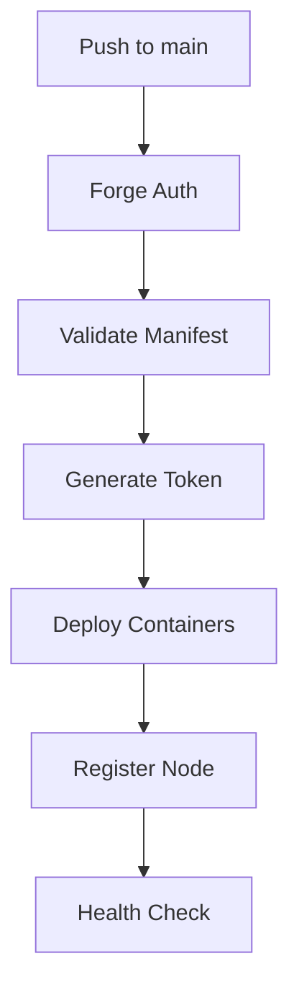

# 🚀 Bridge Runtime Handler - Quick Reference

## ⚡ Quick Commands

```bash
# Initialize Runtime Locally
export FORGE_DOMINION_ROOT="your_key_here"
cd bridge_backend
python bridge_core/runtime_handler.py

# Validate Manifest
python -c "from bridge_core.runtime_handler import RuntimeManifest; m = RuntimeManifest('src/bridge.runtime.yaml'); m.load(); m.validate()"

# Generate Token
python -c "from bridge_core.runtime_handler import ForgeRuntimeAuthority; auth = ForgeRuntimeAuthority(); print(auth.generate_runtime_token('test-node'))"

# Check Active Nodes
cat forge/runtime/active_nodes.json | jq '.nodes'
```

## 📝 Manifest Template

```yaml
version: "1.0"
runtime:
  name: "my-runtime"
  type: "sovereign"
  auth:
    provider: "forge_dominion"
    token_mode: "ephemeral"
    token_ttl: 3600
    auto_renew: true
  containers:
    - name: "api"
      image: "python:3.12-slim"
      command: ["uvicorn", "main:app"]
      ports: ["8000:8000"]
      health_check:
        path: "/health"
        interval: 30
```

## 🔑 Environment Variables

| Variable | Required | Default | Description |
|----------|----------|---------|-------------|
| `FORGE_DOMINION_ROOT` | ✅ Yes | - | Base64url root key |
| `FORGE_DOMINION_MODE` | No | `sovereign` | Operation mode |
| `BRIDGE_RUNTIME_MANIFEST` | No | `src/bridge.runtime.yaml` | Manifest path |

## 🎯 GitHub Secrets

Setup required secrets:

```bash
# Generate and set root key
gh secret set FORGE_DOMINION_ROOT --body "$(python -c 'import base64, os; print(base64.urlsafe_b64encode(os.urandom(32)).decode().rstrip("="))')"

# Set mode
gh variable set FORGE_DOMINION_MODE --body "sovereign"
```

## 🏃 Deployment Flow



## 🔍 Troubleshooting

### Token Issues
```bash
# Check if token is valid
python -c "from bridge_core.runtime_handler import ForgeRuntimeAuthority; import json; auth = ForgeRuntimeAuthority(); token = json.load(open('/tmp/forge_runtime_token.json')); print('Valid' if auth.validate_token(token) else 'Invalid')"
```

### Container Issues
```bash
# Check container status
cat /tmp/forge_runtime_status.json | jq '.containers'
```

### Federation Issues
```bash
# Check lattice heartbeat
cat bridge_backend/logs/lattice_heartbeat.log | tail -20
```

## 📊 Key Metrics

- **Token TTL**: 3600s (1 hour) default
- **Auto-Renewal**: 300s (5 min) before expiry
- **Health Check**: Every 30s
- **Heartbeat**: Every 10s (if federation enabled)

## 🔗 Integration Points

| System | Integration | Status |
|--------|-------------|--------|
| Forge Dominion | Token generation | ✅ Active |
| μ-Harmonic Lattice | Node sync | 🚧 Phase 3 |
| Sovereign Ledger | Log storage | ✅ Active |
| Command Deck | UI display | 🚧 Phase 4 |

## 📚 Related Docs

- [Full BRH Guide](BRH_GUIDE.md)
- [Forge Dominion](FORGE_DOMINION_DEPLOYMENT_GUIDE.md)
- [Runtime Manifest Schema](src/manifest.json)

---

**Last Updated**: 2025-11-03  
**Version**: 1.0.0-alpha  
**Status**: Phase 1 Complete
