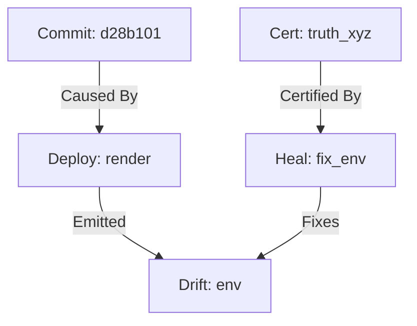

# Umbra Lattice Memory - Quick Reference

> **v1.9.7g — Neural Changelog & Memory Bloom**

## Overview

Umbra Lattice Memory is a self-updating, truth-certified knowledge graph that remembers why and how the Bridge changed—across code, configs, engines, deploys, and auto-heals.

## Key Concepts

### Graph Structure

**Nodes** (entities in the system):
- `engine` - Engine instances and actions
- `change` - Code/config changes
- `deploy` - Deployment events
- `heal` - Repair actions
- `drift` - Configuration drift
- `var` - Environment variables
- `commit` - Git commits
- `cert` - Truth certificates
- `role` - RBAC roles

**Edges** (relationships):
- `caused_by` - Causal relationship
- `fixes` - Repair relationship
- `certified_by` - Truth certification
- `approved_by` - RBAC approval
- `emitted` - Event emission
- `touches` - Affects/modifies
- `supersedes` - Replaces/updates

### Truth Gating

All records must be truth-certified or enter pending queue. Failed certifications auto-roll back to last coherent snapshot.

## REST API

### Get Summary

```bash
GET /api/umbra/lattice/summary
GET /api/umbra/lattice/summary?since=7d
```

Returns:
```json
{
  "timestamp": "2025-10-12T...",
  "window": "7d",
  "total_nodes": 128,
  "total_edges": 311,
  "node_types": {
    "deploy": 42,
    "commit": 38,
    "heal": 24,
    "drift": 12,
    "change": 8,
    "var": 4
  },
  "edge_types": {
    "caused_by": 150,
    "fixes": 80,
    "certified_by": 81
  }
}
```

### Get Mermaid Graph

```bash
GET /api/umbra/lattice/mermaid
GET /api/umbra/lattice/mermaid?since=24h
```

Returns:
```json
{
  "mermaid": "graph TD\n  N0[Deploy: render]\n  N1[Commit: abc123]\n  N1 -->|Caused By| N0",
  "since": "24h"
}
```

### Export Snapshot

```bash
POST /api/umbra/lattice/export
POST /api/umbra/lattice/export?since=7d
```

Returns:
```json
{
  "status": "exported",
  "snapshot": { ... },
  "path": ".umbra/snapshots/snapshot_20251012_211130.json"
}
```

### Run Bloom Analysis

```bash
POST /api/umbra/lattice/bloom
```

Returns:
```json
{
  "status": "complete",
  "analysis": {
    "nodes_analyzed": 200,
    "edges_analyzed": 450,
    "causal_chains": 12,
    "top_causes": [
      {"cause": "commit", "frequency": 42},
      {"cause": "drift", "frequency": 18}
    ],
    "frequent_fixes": [
      {"fix": "fix_env", "frequency": 15},
      {"fix": "restart_service", "frequency": 8}
    ]
  }
}
```

### Get Statistics

```bash
GET /api/umbra/lattice/stats
```

Returns:
```json
{
  "nodes": 256,
  "edges": 612,
  "certified_nodes": 240,
  "certified_edges": 580,
  "pending": 5,
  "snapshots": 8,
  "db_path": "/path/to/.umbra/lattice.db"
}
```

## CLI Commands

### View Report

```bash
# Mermaid graph (default)
python3 -m bridge_backend.cli.umbra lattice report --since 7d

# Summary only
python3 -m bridge_backend.cli.umbra lattice report --since 24h --format summary

# Both
python3 -m bridge_backend.cli.umbra lattice report --since 1w --format both
```

### Export Snapshot

```bash
python3 -m bridge_backend.cli.umbra lattice export
python3 -m bridge_backend.cli.umbra lattice export --since 7d
```

### Run Bloom Analysis

```bash
python3 -m bridge_backend.cli.umbra lattice bloom
```

### View Statistics

```bash
python3 -m bridge_backend.cli.umbra lattice stats
```

## Environment Variables

```bash
# Enable/disable Umbra Lattice (default: true)
UMBRA_ENABLED=true

# Strict truth certification (default: true)
UMBRA_STRICT_TRUTH=true

# Snapshot interval (default: 10m)
UMBRA_SNAPSHOT_INTERVAL=10m
```

## Genesis Integration

Umbra Lattice automatically subscribes to these Genesis topics:

- `deploy.*` - All deployment events
- `envrecon.*` - Environment reconciliation
- `arie.*` - Autonomous repository integrity
- `chimera.*` - Deployment engine events
- `netlify.*`, `render.*`, `github.*` - Platform events
- `truth.*` - Truth certification
- `cascade.*` - Cascade propagation
- `autonomy.*` - Autonomy actions

## Storage

**Location**: `.umbra/`

```
.umbra/
├── lattice.db          # SQLite graph database
└── snapshots/          # JSON snapshots
    ├── snapshot_20251012_211130.json
    ├── snapshot_20251012_181545.json
    └── ...
```

## RBAC

| Role | Capabilities |
|------|--------------|
| **Admiral** | Full control: view, export, bloom, mutate graph |
| **Captain** | View summaries, run queries, export snapshots |
| **Observer** | View summaries only |

## Example Mermaid Output



## Neural Changelog Queries

Coming soon:
- `top_causes --window 30d`
- `frequent_fixes --engine netlify`
- `vars_touched --since deploy/12345`
- `what_changed --between v1.9.6q v1.9.7f`

## Integration Examples

### Record Custom Event

```python
from bridge_backend.bridge_core.engines.umbra.lattice import UmbraLattice

lattice = UmbraLattice()
await lattice.initialize()

await lattice.record_event({
    "type": "deploy_success",
    "service": "render",
    "commit": "abc123",
    "status": "success"
})
```

### Query Recent Nodes

```python
from datetime import datetime, timezone, timedelta

since = datetime.now(timezone.utc) - timedelta(days=7)
nodes = await lattice.storage.get_nodes(kind="deploy", since=since, limit=50)
```

### Generate Visualization

```python
mermaid = await lattice.mermaid(since="7d")
print(mermaid)
```

## Troubleshooting

**Lattice not recording events**
- Check `UMBRA_ENABLED=true`
- Verify Genesis bus is enabled
- Check logs for certification failures

**Snapshots not being created**
- Check `.umbra/snapshots/` directory permissions
- Verify sufficient disk space

**Truth certification failing**
- Check Truth engine is running
- Set `UMBRA_STRICT_TRUTH=false` to bypass (not recommended)

## Related Documentation

- [Umbra Quick Reference](UMBRA_QUICK_REF.md)
- [Genesis Quick Reference](GENESIS_V2_QUICK_REF.md)
- [Truth Engine Documentation](docs/truth_engine.md)
