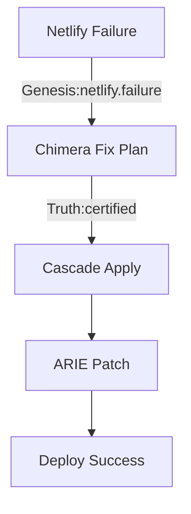

# Umbra Lattice Memory - Overview

**v1.9.7g — Neural Changelog & Memory Bloom**

## What is Umbra Lattice?

Umbra Lattice Memory is a **self-updating, truth-certified knowledge graph** that captures the complete history of how and why the Bridge changes. It transforms your stack's history into a **neural changelog** that engines can learn from and use to predict/avoid future failures.

## The Problem

Before Lattice, the Bridge lacked a unified, queryable memory of:

- **What changed** (code/config/events)
- **Why it changed** (root cause)
- **Who/what authorized it** (RBAC / Truth)
- **How it propagated** (Cascade)
- **What it fixed** (ARIE/Chimera outcomes)

## The Solution

Umbra Lattice provides:

### 1. Graph-First Persistence

A knowledge graph with typed **nodes** and **edges**:

**Nodes** represent entities:
- `engine` - Engine instances
- `change` - Code/config modifications
- `deploy` - Deployment events
- `heal` - Repair actions
- `drift` - Configuration drift
- `var` - Environment variables
- `commit` - Git commits
- `cert` - Truth certificates
- `role` - RBAC roles

**Edges** represent relationships:
- `caused_by` - Causal chains
- `fixes` - Repair relationships
- `certified_by` - Truth certification
- `approved_by` - RBAC approval
- `emitted` - Event emission
- `touches` - Modifications
- `supersedes` - Replacements

### 2. Truth-Gated Writes

Every record requires **truth certification** or enters a **pending queue**. Failed certifications auto-roll back to the last coherent snapshot.

### 3. Causal Maps & Timelines

Generate **PR-ready markdown timelines** and **mermaid diagrams** (text-only, no images):



### 4. Neural Changelog Queries

Query the lattice for insights:

- **Top causes** - Most frequent failure triggers
- **Frequent fixes** - Most common repair patterns
- **Vars touched** - Environment changes by deploy
- **What changed** - Diff between versions

### 5. Genesis Integration

Automatic subscription to key topics:

- `deploy.*` - All deployments
- `envrecon.*` - Environment reconciliation
- `arie.*` - Repository integrity
- `chimera.*` - Deployment engine
- `netlify.*`, `render.*`, `github.*` - Platform events
- `truth.*` - Certifications
- `cascade.*` - Propagation
- `autonomy.*` - Autonomy actions

## Key Features

### Capture

Subscribes to Genesis topics and captures:
- Deploy events
- Environment drift
- Healing actions
- Code changes
- Truth certifications

### Normalize

Maps events into typed nodes/edges with consistent schema.

### Certify

Stores only truth-certified facts; keeps disputed records flagged until certified.

### Bloom

Incrementally builds:
- **Timelines** - Sequential event chains
- **Dependency chains** - What depends on what
- **Causal paths** - Root cause analysis

### Visualize

Emits:
- **Markdown + Mermaid** - Text-based graphs
- **JSON snapshots** - For automation
- **Summary reports** - Quick overviews

## Architecture

```
┌─────────────────────────────────────────────────────────┐
│                   Genesis Event Bus                      │
│  (deploy.*, envrecon.*, arie.*, truth.*, cascade.*)     │
└────────────────────┬────────────────────────────────────┘
                     │
                     ▼
         ┌───────────────────────┐
         │  Umbra Genesis Link   │
         │   (Event Subscriber)  │
         └───────────┬───────────┘
                     │
                     ▼
         ┌───────────────────────┐
         │   Umbra Lattice Core  │
         │  - Normalize events   │
         │  - Truth gate         │
         │  - Record to storage  │
         └───────────┬───────────┘
                     │
                     ▼
         ┌───────────────────────┐
         │  Lattice Storage      │
         │  - SQLite DB          │
         │  - Nodes/Edges        │
         │  - Snapshots          │
         └───────────┬───────────┘
                     │
        ┌────────────┴───────────────┐
        │                            │
        ▼                            ▼
┌───────────────┐          ┌──────────────────┐
│  REST API     │          │   CLI Commands   │
│  - Summary    │          │   - report       │
│  - Mermaid    │          │   - export       │
│  - Export     │          │   - bloom        │
│  - Bloom      │          │   - stats        │
└───────────────┘          └──────────────────┘
```

## Storage

**Location**: `.umbra/`

```
.umbra/
├── lattice.db                     # SQLite graph database
└── snapshots/                      # JSON snapshots
    ├── snapshot_20251012_211130.json
    ├── snapshot_20251012_181545.json
    └── ...
```

### Database Schema

**Tables**:
- `lattice_nodes` - Graph nodes
- `lattice_edges` - Graph edges
- `lattice_pending` - Pending certification queue
- `lattice_snapshots` - Snapshot metadata

**Indices** for performance:
- Node/edge kind lookups
- Timestamp-based queries
- Source/destination lookups

## RBAC

| Role | Capabilities |
|------|--------------|
| **Admiral** | Full control: view, export, bloom, mutate graph |
| **Captain** | View summaries, run queries, export snapshots |
| **Observer** | View summaries only |

All accesses logged to Steward.

## How It Learns

### Pattern Recognition

Umbra Lattice identifies:

1. **Recurring failures** - Same drift/errors happening repeatedly
2. **Effective fixes** - Which repairs work best
3. **Causal chains** - What triggers what
4. **Time patterns** - When failures occur

### Self-Improvement

Over time, Lattice:

- **Predicts failures** - Based on historical patterns
- **Suggests fixes** - Most effective repairs for similar issues
- **Optimizes paths** - Fastest route from problem to solution
- **Prevents recurrence** - Remembers what didn't work

## Integration with Other Engines

### Truth Engine

All Lattice records are certified by Truth, ensuring accuracy and auditability.

### Cascade

Tracks how fixes propagate through the system.

### ARIE

Records autonomous repairs and their outcomes.

### Chimera

Captures deployment events and healing actions.

### Steward

Displays "Neural Changelog" panel in Steward dashboard.

## Result

> **"The Bridge now remembers causality and learns from itself."**

Every fix becomes **reusable intelligence**.  
Every failure becomes a **preemptive rule**.  
Every deploy gains a **provenance trail** (who/what/why/impact).

## Quick Start

See [Umbra Lattice Quick Start](UMBRA_LATTICE_QUICK_START.md) for:
- API endpoints
- CLI commands
- Environment variables
- Integration examples

## Schema Reference

See [Umbra Lattice Schema](UMBRA_LATTICE_SCHEMA.md) for:
- Node types and attributes
- Edge types and semantics
- Event normalization rules
- Query patterns
